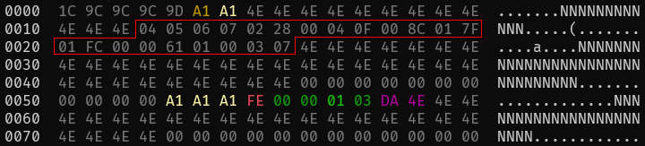
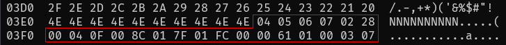

# patch_cpm3.py

## Introduction

patch_cpm3.py is a Python script to patch NABU PC CP/M 3 disk images so they work from simple sector disk images.

## The Problem

NABU CP/M 3 disks store the Disk Parameter Block (DPB) out-of-band at the start of the raw track, where it is read using the WD179x FDC READ_TRACK command:

This information is lost if the disk is converted to a simple sector-based disk image. This has led to many NABU disk images being distributed in HFE format, which work fine with floppy emulators (Gotek/HxC2001), but don't play well with most CP/M tools.

## A Solution

There's plenty of spare space at the end of the boot sector so the DPB can be stored there instead, moving it back in-band so it's preserved in all disk images:

There are two places that read the DPB: the second stage loader (cpmldr) and the main CPM3.SYS program. Code in both can be patched to read the DPB from this new location.

The patch changes the READ_TRACK command to a READ_1SECTOR, and reads up to final 32 bytes in the sector. Control then continues to the existing DPB reading code, which expects to find a run of 4E padding bytes then the DPB data block.

The first 4 bytes of the data block are a fixed `04 05 06 07` pattern as written by the format.com program, which aren't actually checked by anything. The next byte is a disk type, which is one of `00`, `01` or `02`, representing 40x1 / 40x2 / 80x2 disk formats. The final 17 bytes are the actual DPB that contains the CP/M parameters.

The script patches both the cpmldr and the cpm3.sys file, then writes the DPB to the end of the boot sector. The DPB used depends on the size of the raw disk image, so make sure that is correct. The patched image is written out to a new file with a `_patched` suffix.

## Credits

Special thanks to @alitel, who provided much needed NABU technical information and testing. Thanks also to @brijohn for the NABU MAME core, which made debugging much easier.

## License

patch_cpm3.py is released under the [MIT license](https://tldrlegal.com/license/mit-license).

## Contact

Simon Owen
[https://simonowen.com](https://simonowen.com)
